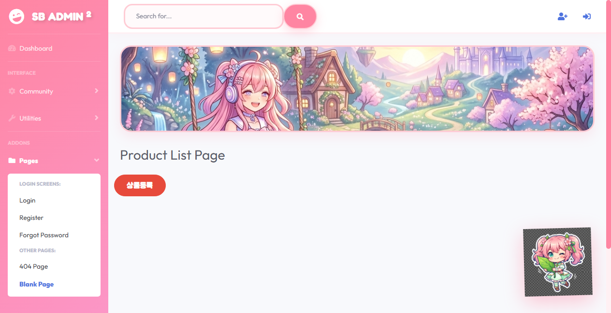

# 🌸 Kosmo Post - Anime Character Theme Project 🌸

귀여운 파스텔 톤 애니메이션 캐릭터 테마가 적용된 스프링 부트 웹 애플리케이션입니다.

---

## 📸 홈페이지 미리보기 (Preview)

---

## ✨ 테마 특징 (Cute Features)
* **둥둥 떠다니는 치비 캐릭터 마스코트** 🧸: 화면 우측 하단에서 둥실둥실 움직이며, 마우스 오버 시 갸우뚱 모션과 함께 클릭 시 **통통 튀어오르는(Bounce) 효과**를 구현했습니다.
* **파스텔 톤 그라데이션 사이드바** 🌸: 은은한 딸기 우유 핑크와 라벤더 펄이 섞인 움직이는 그라데이션을 적용했습니다.
* **둥글둥글한 라운딩 카드 및 테두리** 🎀: 24px의 둥글둥글한 카드와 도톰한 핑크빛 테두리로 만화책 일러스트 같은 입체감을 주었습니다.
* **동화풍 하늘 배너** ☁️: 화면 상단에 몽환적인 파스텔 톤 구름 하늘과 정원 일러스트 배너를 적용했습니다.

---

## 🛠️ 구동 기술 (Tech Stack)
* **Backend**: Java 21, Spring Boot 3.5.13
* **Database**: H2 (In-memory PostgreSQL Mode, 자동 DDL 생성)
* **ORM / Mapper**: MyBatis
* **UI Framework**: Bootstrap (via CDN), StartBootstrap SB Admin 2
* **Fonts**: Fredoka One, Outfit, Jua (주아체)
